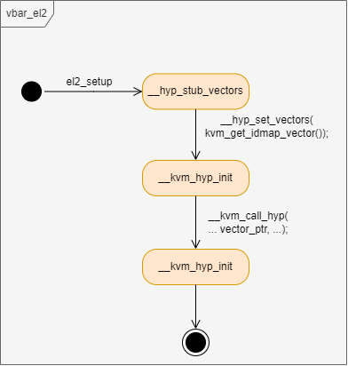

# 2 模式切换基础设施的初始化

> 内核版本：linux-v5.9
>
> 架构：arm64

### 2.1 什么是模式切换

在描述type1型虚拟机管理器时使用了层次分明这个词，在type2型虚拟机管理器的场景下，很明显并不层次分明。回顾具体到linux+kvm的type2型虚拟机管理器框架图，如图2.1所示。

<figure><figcaption><p>图2.1 type2型虚拟机管理器框架图</p></figcaption></figure>

其中Host OS和Guest OS有很大的不同，例如对地址空间的访问。假设运行在EL1的Host OS和Guest OS都开启了虚拟地址空间访问，Host OS对虚拟地址的寻址只有一个阶段，即VA到PA，而Guest OS对虚拟地址的寻址则需要两个阶段，即VA到IPA，再到PA。如何进行这样的转换，以后通过具体的情景再描述。那么在type2型虚拟机管理器的场景下出现一个问题，即同样运行在EL1异常级别的Host OS和Guest OS如何区分，换句话说在一个机器上，EL1的上下文（硬件环境）只有一个，如何区分这一个EL1级别上运行的是Host OS还是Guest OS。

Host OS和Guest OS虽然都运行在EL1，但它们本质是不一样的。Host OS运行的时候是在不开启虚拟化功能的环境下运行的，而Guest OS运行的时候需要在开启虚拟化功能的环境下运行。是否为开启虚拟化功能的环境则取决于系统寄存器的环境，具体是指arm架构指定的一套虚拟化寄存器环境，例如：

* 虚拟机管理器控制寄存器（HCR\_EL2，Hypervisor Configuration Register）：该寄存器提供虚拟化的配置控制，例如是否开启虚拟化、各种操作是否被捕获到 EL2和是否开启stage2地址转换；
* 虚拟转换控制寄存器（VTCR\_EL2，Virtualization Translation Control Register）：该寄存器控制stage2地址翻译的规则，例如stage2地址翻译的位数、页表大小和vmid位数；
* GICv2的虚拟机管理器控制寄存器（GICH\_HCR，Hypervisor Control Register）：寄存器包含VCPU interface的控制位。该寄存器在EL1能访问，但由于是虚拟化场景下使用的寄存器，故将其列在此处。
* ......

以上列出了部分虚拟化寄存器环境，这些虚拟化相关寄存器的值影响（决定）了EL1运行时的OS是Host OS还是Guest OS。具体以HCR\_EL2控制寄存器为例，在linux中Host OS和Guest OS的宏定义如下：

> 注：本章代码均为NVHE场景。

```c
/* arch/arm64/include/asm/kvm_arm.h */
/*
 * The bits we set in HCR:
 * TLOR:	Trap LORegion register accesses
 * RW:		64bit by default, can be overridden for 32bit VMs
 * TAC:		Trap ACTLR
 * TSC:		Trap SMC
 * TSW:		Trap cache operations by set/way
 * TWE:		Trap WFE
 * TWI:		Trap WFI
 * TIDCP:	Trap L2CTLR/L2ECTLR
 * BSU_IS:	Upgrade barriers to the inner shareable domain
 * FB:		Force broadcast of all maintainance operations
 * AMO:		Override CPSR.A and enable signaling with VA
 * IMO:		Override CPSR.I and enable signaling with VI
 * FMO:		Override CPSR.F and enable signaling with VF
 * SWIO:	Turn set/way invalidates into set/way clean+invalidate
 * PTW:		Take a stage2 fault if a stage1 walk steps in device memory
 */
#define HCR_GUEST_FLAGS (HCR_TSC | HCR_TSW | HCR_TWE | HCR_TWI | HCR_VM | \
			 HCR_BSU_IS | HCR_FB | HCR_TAC | \
			 HCR_AMO | HCR_SWIO | HCR_TIDCP | HCR_RW | HCR_TLOR | \
			 HCR_FMO | HCR_IMO | HCR_PTW )
#define HCR_HOST_NVHE_FLAGS (HCR_RW | HCR_API | HCR_APK)
```

若EL1要运行Host OS，则将hcr\_el2寄存器的值设置为`HCR_HOST_NVHE_FLAGS`；若EL1要运行Guest OS，则将hcr\_el2寄存器的值设置为`HCR_GUEST_FLAGS`（会根据虚拟机的配置设置更多位）。该寄存器每一位的具体含义暂不描述，若需了解具体含义可直接查看arm架构参考手册。

将包含hcr\_el2在内的、影响低异常级别行为的虚拟化寄存器环境称为运行环境。将Host OS的运行环境称为Host OS模式，Guest OS的运行环境称为Guest OS模式，它们之间的切换则为模式切换。总结的说就是EL2的寄存器设置影响（决定）EL1的运行环境，将EL2的控制寄存器设置为开启虚拟化的设置，即进入Guest OS模式，反之则进入Host OS模式。

### 2.2 模式切换基础设施

虚拟化相关的寄存器大多只能在EL2异常级别访问，并且Host OS模式与Guest OS模式之间的切换要经过一系列的流程。回顾第1章中type2型Guest OS串口访问的情景，如图2.2所示。&#x20;

<figure><figcaption><p>图2.2 type2型Guest OS模拟串口访问流程图</p></figcaption></figure>

如图2.2所示，当需要进行模式切换的时候，首先进入EL2异常级别，在EL2异常级别中完成Guest OS模式与Host OS模式的切换。EL1进入EL2这一流程依赖arm架构的异常处理流程，即EL1触发异常，并在EL2被捕获。EL2捕获异常则需要设置EL2的异常向量表、异常向量表基址寄存器（vbar\_el2）和保存程序状态寄存器（spsr\_el2）。**本文将这些和EL2异常配置相关的内容称为模式切换基础设施**，因为正是这些基础设施的正确设置，使能并保证了Guest OS和Host OS之间的模式切换。

### 2.3 模式切换基础设施的初始化

之前的内容介绍了什么是模式切换，以及进行模式切换需要的基础设施，本节则以linux代码描述基础设施是如何构建起来的。这部分的代码是linux中与虚拟化相关的较早的代码，所说的早是基于从linux启动到使用kvm功能这个时间线。

首先说明一个前提条件，linux要从EL2启动，即引导linux的程序需要将linux设置在EL2启动。因为linux启动后首先需要在EL2进行一些基础的设置，这些设置会随着初始化的流程更新，但总要有一个开始，这个开始的条件就是要从EL2启动。这里以qemu-system-aarch64启动linux的情景描述，为了让linux在EL2启动，需要为qemu添加参数`virtualization=on`，如下所示：

```bash
qemu-system-aarch64 \
	-machine virt,gic-version=2,virtualization=on,type=virt \
	-cpu cortex-a57 \
	-smp 1 \
	-m 512M \
	-nographic \
	-kernel linux/arch/arm64/boot/Image  \
	-initrd busybox-1.36.1/_install/rootfs.cpio   \
	-append "rdinit=/linuxrc console=ttyAMA0"
```

通过该命令启动，linux开始运行时则是在EL2异常级别运行。linux先进行主核启动：

```armasm
/* arch/arm64/kernel/head.S */
SYM_CODE_START(primary_entry)
	bl	preserve_boot_args
	bl	el2_setup			// Drop to EL1, w0=cpu_boot_mode
	adrp	x23, __PHYS_OFFSET
	and	x23, x23, MIN_KIMG_ALIGN - 1	// KASLR offset, defaults to 0
	bl	set_cpu_boot_mode_flag
	......
SYM_CODE_END(primary_entry)
```

主核启动首先将启动参数保存起来，然后调用`el2_setup`函数，该函数会对EL2异常级别的一些寄存器进行最初的初始化，其中就包含EL2异常配置相关的内容。该函数主要做了如下事情：

* 判断当前的运行级别是EL1还是EL2，若是EL1，则设置sctlr\_el1后返回`BOOT_CPU_MODE_EL1`（w0中保存返回值）；若是EL2，则设置sctlr\_el2后进行后面的流程，该寄存器提供EL2异常级别的控制，具体内容见arm架构参考手册。这里要判断一下异常级别是因为linux要兼顾从EL1和EL2启动的情况，在本文的情境下是从EL2启动；
* 在时钟虚拟化中，需要将虚拟计时器给Guest OS使用，Host OS则使用物理计时器，所以这里使能EL1的物理计时器。这里说明一下，在未开启虚拟化的场景下，通常linux使用的是虚拟计时器，这样的设计应该是考虑到这样的场景：当linux作为虚拟机运行在一个hypervisor之上时，hypervisor会用物理计时器，linux使用虚拟计时器，linux不用做代码修改；
* 该函数除了主核启动时会调用，从核启动时也会调用。这为设置CPU的EL2标识寄存器（vpidr\_el2和vmpidr\_el2）提供了时机，即每个CPU启动后读取EL1标识寄存器（midr\_el1和mpidr\_el1）保存在EL2标识寄存器；
* Host OS模式未使能stage2地址翻译，将stage2地址翻译的基址寄存器（vttbr\_el2）清零；
* 最后设置异常向量表基址寄存器（vbar\_el2）和保存程序状态寄存器（spsr\_el2）。设置完成后将lr寄存器的值保存在elr\_el2，并将w0赋值为`BOOT_CPU_MODE_EL2`，随后执行eret。这样做是因为lr中保存函数调用的返回值，elr\_el2则是异常返回的返回地址，这样执行eret后即返回到了调用el2\_setup函数时应该的返回地址，并且将异常等级降到了EL1。

此处着重描述最后一点，其代码如下所示：

```armasm
/* arch/arm64/kernel/head.S */
SYM_FUNC_START(el2_setup)
	......

	/* Hypervisor stub */
7:	adr_l	x0, __hyp_stub_vectors
	msr	vbar_el2, x0

	/* spsr */
	mov	x0, #(PSR_F_BIT | PSR_I_BIT | PSR_A_BIT | PSR_D_BIT |\
		      PSR_MODE_EL1h)
	msr	spsr_el2, x0
	msr	elr_el2, lr
	mov	w0, #BOOT_CPU_MODE_EL2		// This CPU booted in EL2
	eret
SYM_FUNC_END(el2_setup)
```

系统寄存器每一位的含义可查看arm架构参考手册，此处将重点放在`__hyp_stub_vectors`，这个变量是一个异常向量表的基地址，该异常向量表是开启了kvm功能的linux最开始的EL2异常向量表。在kvm初始化时，linux调用`hvc`指令时，就会在EL2被捕获，并且根据该异常向量表跳转到对应的异常处理函数处。

\_\_hyp\_stub\_vectors异常向量表的内容下所示：

```armasm
/* arch/arm64/kernel/hyp-stub.S */
	.text
	.pushsection	.hyp.text, "ax"

	.align 11

SYM_CODE_START(__hyp_stub_vectors)
	ventry	el2_sync_invalid		// Synchronous EL2t
	ventry	el2_irq_invalid			// IRQ EL2t
	ventry	el2_fiq_invalid			// FIQ EL2t
	ventry	el2_error_invalid		// Error EL2t

	ventry	el2_sync_invalid		// Synchronous EL2h
	ventry	el2_irq_invalid			// IRQ EL2h
	ventry	el2_fiq_invalid			// FIQ EL2h
	ventry	el2_error_invalid		// Error EL2h

	ventry	el1_sync			// Synchronous 64-bit EL1
	ventry	el1_irq_invalid			// IRQ 64-bit EL1
	ventry	el1_fiq_invalid			// FIQ 64-bit EL1
	ventry	el1_error_invalid		// Error 64-bit EL1

	ventry	el1_sync_invalid		// Synchronous 32-bit EL1
	ventry	el1_irq_invalid			// IRQ 32-bit EL1
	ventry	el1_fiq_invalid			// FIQ 32-bit EL1
	ventry	el1_error_invalid		// Error 32-bit EL1
SYM_CODE_END(__hyp_stub_vectors)
```

通过该代码可以看到，该异常向量表其实只用到了一个，即el1\_sync，该异常向量中的目标函数，就是EL2捕获EL1发生同步异常后执行的函数。该函数的内容暂不描述，后文到需要访问该函数时再描述。

本文通过vbar\_el2寄存器内容的状态图刻画：模式切换基础设施逐步完善的流程。经过el2\_setup函数后，vbar\_el2寄存器的内容状态如图2.3所示。

<figure><figcaption><p>图2.3 vbar_el2状态图（el2_setup）</p></figcaption></figure>

跟随模式切换基础设施初始化这一情景，`__hyp_stub_vectors`在未初始化kvm之前不会被访问，当初始化kvm时，`__hyp_stub_vectors`被访问。kvm是作为linux的一个模块进行初始化的，具体到arm64架构下，kvm的初始化从`arm_init()`函数开始：

```c
/* arch/arm64/kvm/arm.c */
static int arm_init(void)
{
	int rc = kvm_init(NULL, sizeof(struct kvm_vcpu), 0, THIS_MODULE);
	return rc;
}

module_init(arm_init);
```

只关注EL2异常向量表的设置，`arm_init()`的函数调用图如图2.4所示。

<figure><figcaption><p>图2.4 kvm模式切换基础设置初始化函数调用图</p></figcaption></figure>

如图2.4所示，EL2异常向量表在el2\_setup函数设置为`__hyp_stub_vectors`后，在kvm初始化时又被重新设置了两次。第一次是在图2.4中的`__hyp_set_vectors`函数，该函数将异常向量表设置为`__kvm_hyp_init`；第二次是在图2.4中的`__kvm_call_hyp`函数，该函数将异常向量设置为`__kvm_hyp_vector`。图2.4中除了`init_subsystems`函数和`cpu_init_hyp_mode`函数，其他的函数实现并不复杂，不过多描述，可根据图2.4为依据阅读linux源码。

现在详细描述图2.4中访问到EL2异常向量表的部分。图2.4中共三次调用了`hvc`触发同步异常：

* `__hyp_reset_vector`：在更新EL2异常向量表前需要重设好一个已有的EL2异常向量表，由于在el2\_setup函数中已经设置好了EL2异常向量表，所以此次调用进入EL2后执行el1\_sync函数（执行hvc调用时x0的值为`HVC_RESET_VECTORS`），代码如下：

```armasm
/* arch/arm64/kernel/hyp-stub.S */
SYM_CODE_START_LOCAL(el1_sync)
	cmp	x0, #HVC_SET_VECTORS
	b.ne	2f
	......
2:	cmp	x0, #HVC_SOFT_RESTART
	b.ne	3f
	......
3:	cmp	x0, #HVC_RESET_VECTORS
	beq	9f				// Nothing to reset!
	......
9:	mov	x0, xzr
	eret
SYM_CODE_END(el1_sync)
```

可以看到当x0的值为HVC\_RESET\_VECTORS时，经过几次跳转后直接返回0到EL1。

* `__hyp_set_vectors`：确定EL2的异常向量表时访问正常的，然后再次进入EL2后执行el1\_sync更新EL2异常向量表为`__kvm_hyp_init`，执行hvc调用时x0的值为`HVC_SET_VECTORS`，代码如下：

```armasm
/* arch/arm64/kernel/hyp-stub.S */
SYM_CODE_START_LOCAL(el1_sync)
	cmp	x0, #HVC_SET_VECTORS
	b.ne	2f
	msr	vbar_el2, x1
	b	9f
	......
9:	mov	x0, xzr
	eret
SYM_CODE_END(el1_sync)
```

此次异常返回后，若再EL2再次捕获到EL1的同步异常，则会到新的异常向量表（`__kvm_hyp_init`）寻址目标函数。\_\_kvm\_hyp\_init异常向量表的内容如下所示：

```armasm
/* arch/arm64/kvm/hyp/nvhe/hyp-init.S */
	.text
	.pushsection	.hyp.idmap.text, "ax"

	.align	11

SYM_CODE_START(__kvm_hyp_init)
	ventry	__invalid		// Synchronous EL2t
	ventry	__invalid		// IRQ EL2t
	ventry	__invalid		// FIQ EL2t
	ventry	__invalid		// Error EL2t

	ventry	__invalid		// Synchronous EL2h
	ventry	__invalid		// IRQ EL2h
	ventry	__invalid		// FIQ EL2h
	ventry	__invalid		// Error EL2h

	ventry	__do_hyp_init		// Synchronous 64-bit EL1
	ventry	__invalid		// IRQ 64-bit EL1
	ventry	__invalid		// FIQ 64-bit EL1
	ventry	__invalid		// Error 64-bit EL1

	ventry	__invalid		// Synchronous 32-bit EL1
	ventry	__invalid		// IRQ 32-bit EL1
	ventry	__invalid		// FIQ 32-bit EL1
	ventry	__invalid		// Error 32-bit EL1
```

该异常向量表的内容依然较为简单，只提供EL1同步异常的处理，即执行`__do_hyp_init`函数。这段代码中有一个重点：将该文件的代码安排在了`.hyp.idmap.text`代码段，该代码段可在链接脚本中看到具体放在了什么地方。通过段名可以看出来是做了一个恒等映射，即在EL2运行的这段代码，虚拟地址和物理地址相同。这样做的目的是因为在\_\_do\_hyp\_init函数中会开启EL2的stage1虚拟地址翻译，那么在开启前的代码和开启后的代码是在一起写的，为了能够正常运行，所以做恒等映射。

* `__kvm_call_hyp`：`__kvm_hyp_init`异常向量表是指一个跳板，用于运行初始化EL2的环境。初始化的时候，会设置地址翻译和异常响亮表，其中异常向量表会更新到`__kvm_hyp_vector`，初始化中和异常向量表的设置相关的代码如下所示：

```armasm
/* arch/arm64/kvm/hyp/nvhe/hyp-init.S */
	/*
	 * x0: HYP pgd
	 * x1: HYP stack
	 * x2: HYP vectors
	 * x3: per-CPU offset
	 */
__do_hyp_init:
	......
	msr	vbar_el2, x2
	......
	/* Hello, World! */
	eret
```

`__kvm_hyp_vector`就是未来kvm中模式切换的基础设施，其具体内容暂不描述，可在linux中直接查看，后续通过具体的情景再描述对应的代码。

再次通过vbar\_el2寄存器内容的状态图刻画：模式切换基础设施逐步完善的流程。经过上述流程之后，vbar\_el2寄存器的内容状态如图2.5所示。

<figure><figcaption><p>图2.3 vbar_el2状态图（__kvm_call_hyp）</p></figcaption></figure>

到这里和EL2异常响亮表相关的设置就完成了，即模式切换基础设施的初始化完成了，后续需要EL2处理的工作通过该异常向量表访问即可。
