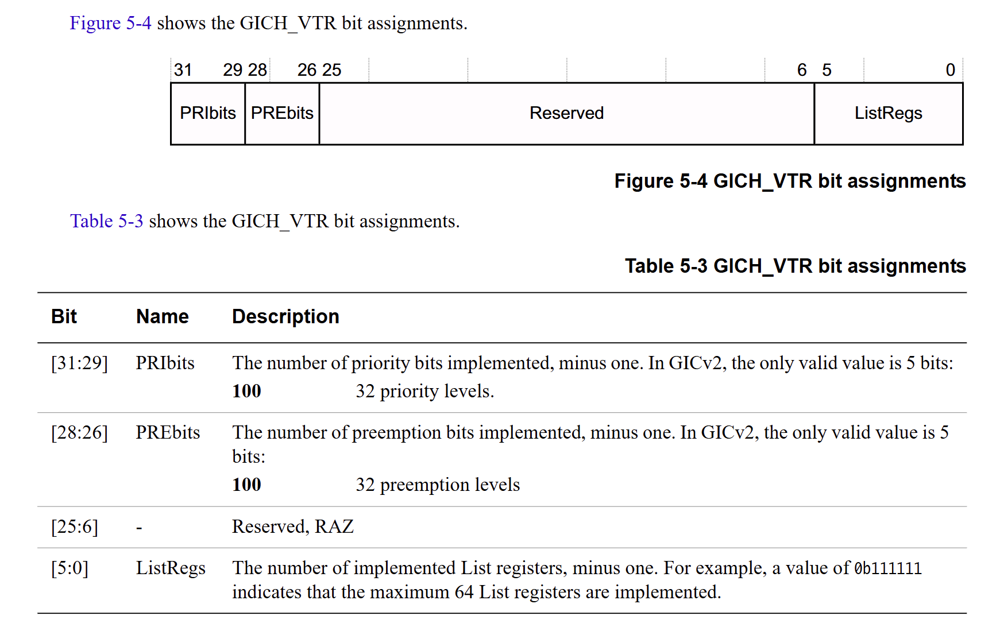

# 4 kvm杂项设备的初始化及访问

> 内核版本：linux-5.9
>
> 架构：arm64

内核需要提供接口供用户态使用内核中的功能和机制，常见的接口有系统调用。kvm作为内核中的一个功能，提供了一个kvm杂项设备，用户可以通过访问该杂项设备使用内核中的kvm功能，该杂项设备如图4.1所示。本节将描述该杂项设备的创建，并且概括性的描述用户通过该杂项设备使用哪些功能。

讲述完kvm杂项设备的初始化和通过该杂项设备能访问功能后，结合一个情景来讲述kvm杂项设备的访问：本节会通过一个用户态程序访问kvm杂项设备，通过kvm杂项设备获取内核kvm的API版本，并讲述获取内核kvm的API版本的实现细节。

### 4.1 kvm杂项设备的注册及其操作函数

kvm杂项设备的注册在`kvm_init`函数中：

```c
// virt/kvm/kvm_main.c
static struct file_operations kvm_chardev_ops = {
	.unlocked_ioctl = kvm_dev_ioctl,
	.llseek		= noop_llseek,
	KVM_COMPAT(kvm_dev_ioctl),
};

static struct miscdevice kvm_dev = {
	KVM_MINOR,
	"kvm",
	&kvm_chardev_ops,
};

int kvm_init(void *opaque, unsigned vcpu_size, unsigned vcpu_align,
		  struct module *module)
{
	......
	
	r = misc_register(&kvm_dev);
	if (r) {
		pr_err("kvm: misc device register failed\n");
		goto out_unreg;
	}
	
	......
}
```

如上述代码所示，使用`misc_register`函数注册kvm杂项设备，注册之后会在/dev目录下创建/dev/kvm设备文件，用户态中的程序就可以通过该文件使用内核中的kvm功能。最终的操作函数为kvm\_dev变量中定义的`kvm_chardev_ops`。

### 4.2 用户态获取kvm的API版本 - 源码示例

在当前工作目录中创建kvm-analysis目录，进入kvm-analysis目录，然后创建get\_version.c文件：

```
kvm-analysis$ touch get_version.c
```

下载linux-5.9源码到任意目录，假设现在将linux-5.9源码下载到了kvm-analysis目录下。进入linux-5.9源码中将arm64架构的linux5.9头文件安装至kvm-analysis目录下，执行下述命令：

```
kvm-analysis/linux-5.9$ make ARCH=arm64 INSTALL_HDR_PATH=../ headers_install
```

get\_version.c文件内容为：

```c
// kvm-analysis/get_version.c
#include <stdio.h>
#include <string.h>
#include <unistd.h>
#include <assert.h>
#include <sys/types.h>
#include <sys/stat.h>
#include <fcntl.h>
#include <sys/ioctl.h>
#include <linux/errno.h>
#include <linux/kvm.h>

#define DEFAULT_KVM_DEV		"/dev/kvm"

int main(int argc, char *argv[])
{
	int sys_fd;
	int errno;
	long kvm_api_version;

	sys_fd = open(DEFAULT_KVM_DEV, O_RDWR);
	if (sys_fd < 0) {
		if (errno == ENOENT)
			printf("'%s' not found. Please make sure your kernel has CONFIG_KVM "
			       "enabled and that the KVM modules are loaded.", DEFAULT_KVM_DEV);
		else if (errno == ENODEV)
			printf("'%s' KVM driver not available.\n  # (If the KVM "
			       "module is loaded then 'dmesg' may offer further clues "
			       "about the failure.)", DEFAULT_KVM_DEV);
		else
			printf("Could not open %s: ", DEFAULT_KVM_DEV);
		
		return -errno;
	}

	kvm_api_version = ioctl(sys_fd, KVM_GET_API_VERSION, 0);
	if (kvm_api_version != KVM_API_VERSION) {
		printf("KVM_API_VERSION ioctl");
		close(sys_fd);
		return -errno;
	}

	printf("kvm_api_verison = %d\n", kvm_api_version);

	return 0;
}
```

编写Makefile文件，注意修改交叉工具链的路径，建议使用与本文档相同版本的工具链（arm官网下载）：

> 下载地址：[https://developer.arm.com/downloads/-/arm-gnu-toolchain-downloads](https://developer.arm.com/downloads/-/arm-gnu-toolchain-downloads)

```makefile
# kvm-analysis/Makefile
CC=../toolchains/arm-gnu-toolchain-11.3.rel1-x86_64-aarch64-none-linux-gnu/bin/aarch64-none-linux-gnu-gcc

INCLUDES = -I./include

all: get_version

get_version: get_version.c
	$(CC) $(INCLUDES) -static get_version.c -g -o get_version

clean:
	rm get_version
```

编译链接：

```
kvm-analysis$ make all
```

### 4.3 用户态获取kvm的API版本 - 运行指南

该用户态程序编译完成之后，将可执行文件`get_version`加入到根文件系统中，并将根文件系统打包为rootfs.cpio。使用如下命令运行支持kvm功能的linux虚拟机：

```bash
qemu-system-aarch64 \
	-machine virt,gic-version=2,virtualization=on,type=virt \
	-cpu cortex-a57 \
	-smp 1 \
	-m 512M \
	-nographic \
	-kernel linux/arch/arm64/boot/Image  \
	-initrd busybox-1.36.1/_install/rootfs.cpio   \
	-append "rdinit=/linuxrc console=ttyAMA0"
```

> 注意修改Image和根文件系统的路径。

进入linux虚拟机的shell后，执行ls命令，可看到get\_version可执行文件：

<figure><figcaption><p>图4.1 get_version运行截图1</p></figcaption></figure>

然后运行`get_version`可执行文件：

<figure><figcaption><p>图4.2 get_version运行截图2</p></figcaption></figure>

如图4.2所示，获取到kvm的API版本为12，在get\_version程序中会检查获取到的版本号是否等于`KVM_API_VERSION`，该宏定义在linux的头文件里：

```c
// include/linux/kvm.h
#define KVM_API_VERSION 12
```

所以通多kvm杂项设备获得的API版本号与头文件中定义的API版本号一致。

### 4.4 用户态获取kvm的API版本 - 源码分析

```c
// kvm-analysis/get_version.c
#include <stdio.h>
#include <string.h>
#include <unistd.h>
#include <assert.h>
#include <sys/types.h>
#include <sys/stat.h>
#include <fcntl.h>
#include <sys/ioctl.h>
#include <linux/errno.h>
#include <linux/kvm.h>

#define DEFAULT_KVM_DEV		"/dev/kvm"

int main(int argc, char *argv[])
{
	......

	sys_fd = open(DEFAULT_KVM_DEV, O_RDWR);
	if (sys_fd < 0) {
		if (errno == ENOENT)
			printf("'%s' not found. Please make sure your kernel has CONFIG_KVM "
			       "enabled and that the KVM modules are loaded.", DEFAULT_KVM_DEV);
		else if (errno == ENODEV)
			printf("'%s' KVM driver not available.\n  # (If the KVM "
			       "module is loaded then 'dmesg' may offer further clues "
			       "about the failure.)", DEFAULT_KVM_DEV);
		else
			printf("Could not open %s: ", DEFAULT_KVM_DEV);
		
		return -errno;
	}

	......
```

上述代码首先打开/dev/kvm设备，用户态程序通过该操作获得kvm杂项设备的句柄，后续就通过该句柄访访问kvm功能。这里分析为何通过该句柄可以访问到kvm功能，这个问题首先要看kvm杂项设备的注册。

```c
// virt/kvm/kvm_main.c
static struct miscdevice kvm_dev = {
	KVM_MINOR,
	"kvm",
	&kvm_chardev_ops,
};

int kvm_init(void *opaque, unsigned vcpu_size, unsigned vcpu_align,
		  struct module *module)
{
	......
	
	r = misc_register(&kvm_dev);
	if (r) {
		pr_err("kvm: misc device register failed\n");
		goto out_unreg;
	}
	
	......
}
```

kvm\_dev杂项设备定义在kvm\_main.c中，其中定义了KVM杂项设备的从设备号、名字和kvm设备操作函数。下面看misc\_register函数的内容：

```c
// drivers/char/misc.c
int misc_register(struct miscdevice *misc)
{
	dev_t dev;
	int err = 0;
	bool is_dynamic = (misc->minor == MISC_DYNAMIC_MINOR);

	INIT_LIST_HEAD(&misc->list);

	mutex_lock(&misc_mtx);

	if (is_dynamic) {
		......
	} else {
		struct miscdevice *c;

		list_for_each_entry(c, &misc_list, list) {
			if (c->minor == misc->minor) {
				err = -EBUSY;
				goto out;
			}
		}
	}

	......
}
```

在misc\_register函数中，首先判断要注册的杂项设备是否需要动态分配设备号。在当前的情景中，提前定义好了kvm杂项设备的从设备号为`KVM_MINOR`，即232，所以不需要动态分配设备号。misc\_list链表中保存有当前系统中已经注册的杂项设备，遍历该链表检查是否已经注册过了，若已注册则返回`-BUSY`错误码，没有注册过则进行后续操作。

```c
// drivers/char/misc.c
int misc_register(struct miscdevice *misc)
{
	......

	dev = MKDEV(MISC_MAJOR, misc->minor);

	misc->this_device =
		device_create_with_groups(misc_class, misc->parent, dev,
					  misc, misc->groups, "%s", misc->name);
	if (IS_ERR(misc->this_device)) {
		if (is_dynamic) {
			int i = DYNAMIC_MINORS - misc->minor - 1;

			if (i < DYNAMIC_MINORS && i >= 0)
				clear_bit(i, misc_minors);
			misc->minor = MISC_DYNAMIC_MINOR;
		}
		err = PTR_ERR(misc->this_device);
		goto out;
	}

	/*
	 * Add it to the front, so that later devices can "override"
	 * earlier defaults
	 */
	list_add(&misc->list, &misc_list);
 out:
	mutex_unlock(&misc_mtx);
	return err;
}
```

检查得知kvm杂项设备杂项设备未注册之后，计算该杂项设备的设备号：主设备号为杂项设备的主设备号，从设备号为kvm设备的从设备号。然后以计算出的设备号创建一个设备，若创建失败则返回错误码，创建成功则将kvm杂项设备记录在`misc_list`中。创建完设备的过程中会在`/dev`目录下建立`kvm`设备文件节点。get\_version程序中打开的`/dev/kvm`文件，就是该设备文件。

到这里已经明确`/dev/kvm`设备文件是一个杂项设备文件，所以对该文件执行open操作会运行到杂项设备的open操作函数：

```c
// drivers/char/misc.c
static const struct file_operations misc_fops = {
	.owner		= THIS_MODULE,
	.open		= misc_open,
	.llseek		= noop_llseek,
};

static int __init misc_init(void)
{
	......

	err = -EIO;
	if (register_chrdev(MISC_MAJOR, "misc", &misc_fops))
		goto fail_printk;
	misc_class->devnode = misc_devnode;
	return 0;

	......
}
```

`misc_open`函数的详细内容如下：

```c
// drivers/char/misc.c
static int misc_open(struct inode *inode, struct file *file)
{
	int minor = iminor(inode);
	struct miscdevice *c;
	int err = -ENODEV;
	const struct file_operations *new_fops = NULL;

	mutex_lock(&misc_mtx);

	list_for_each_entry(c, &misc_list, list) {
		if (c->minor == minor) {
			new_fops = fops_get(c->fops);
			break;
		}
	}

	if (!new_fops) {
		......
	}

	......
}
```

首先通过inode获得杂项设备的从设备号，inode结构中的设备号在创建设备文件节点的时候被指定。获取之后遍历`misc_list`中的杂项设备，在当前情境下应找到kvm杂项设备，然后记录下kvm杂项设备的操作函数，记为`new_fops`。在当前情景中，注册了kvm杂项设备，并且kvm杂项设备的fops成员已经定义过了，即`kvm_chardev_ops`，所以后面的if逻辑的代码路径跳过。if逻辑中的代码大致为通过设备号尝试加载模块，然后再遍历一次`misc_list`以获取`new_fops`。

```c
// drivers/char/misc.c
static int misc_open(struct inode *inode, struct file *file)
{
	......

	/*
	 * Place the miscdevice in the file's
	 * private_data so it can be used by the
	 * file operations, including f_op->open below
	 */
	file->private_data = c;

	err = 0;
	replace_fops(file, new_fops);
	if (file->f_op->open)
		err = file->f_op->open(inode, file);
fail:
	mutex_unlock(&misc_mtx);
	return err;
}
```

然后将file结构中的`private_data`成员赋值为kvm杂项设备结构，并更新file结构中的`f_op`成员为`new_fops`，即`kvm_chardev_ops`。最后尝试执行新文件操作中的open操作，`kvm_chardev_ops`中未定义open成员，所以这里`file->f_op->open`为空，最后返回err结束整个open操作。

总结上述open的过程，可以得知后续用户态程序再使用/dev/kvm对用的文件描述符时，最后调用的操作函数即为`kvm_chardev_ops`中定义的操作函数。

回到用户态程序：

```c
// kvm-analysis/get_version.c
int main(int argc, char *argv[])
{
	......

	kvm_api_version = ioctl(sys_fd, KVM_GET_API_VERSION, 0);
	if (kvm_api_version != KVM_API_VERSION) {
		printf("KVM_API_VERSION ioctl");
		close(sys_fd);
		return -errno;
	}

	printf("kvm_api_verison = %d\n", kvm_api_version);

	return 0;
}
```

这里的sys\_fd文件描述符所对应的文件操作即为`kvm_chardev_ops`。再次回顾kvm\_chardev\_ops内容：

```c
// virt/kvm/kvm_main.c
static struct file_operations kvm_chardev_ops = {
	.unlocked_ioctl = kvm_dev_ioctl,
	.llseek		= noop_llseek,
	KVM_COMPAT(kvm_dev_ioctl),
};
```

然后调用ioctl函数获取kvm的API版本，最终调用的就是`kvm_dev_ioctl`函数。

```c
// virt/kvm/kvm_main.c
static long kvm_dev_ioctl(struct file *filp,
			  unsigned int ioctl, unsigned long arg)
{
	long r = -EINVAL;

	switch (ioctl) {
	case KVM_GET_API_VERSION:
		if (arg)
			goto out;
		r = KVM_API_VERSION;
		break;

	......
	
	}
out:
	return r;
}
```

用户态程序传递的ioctl命令为`KVM_GET_API_VERSION`，所以这里返回`KVM_API_VERSION`，用户态程序就获得了内核中kvm的API版本。

通过获取内核中kvm的版本号这一情景，分析了kvm杂项设备的初始化及访问过程。用户态能看到访问接口就是`/dev/kvm`，通过访问该设备文件，就可以使用内核中的kvm功能。
