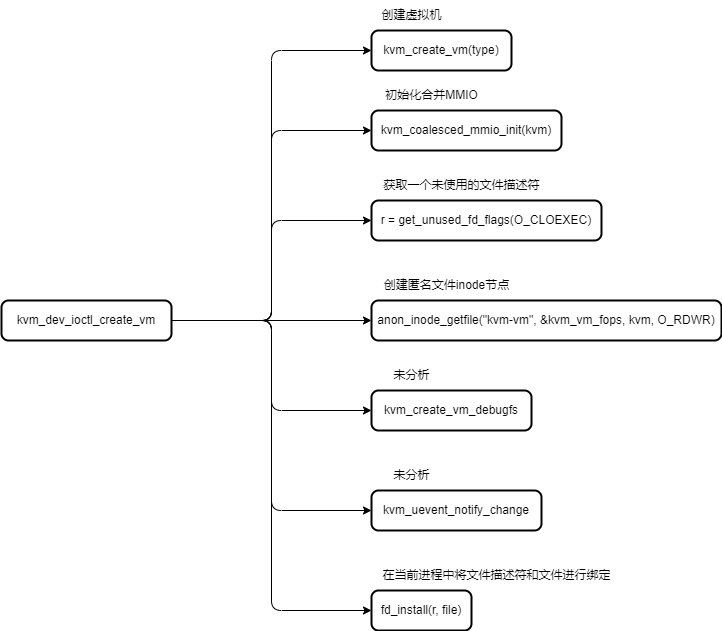
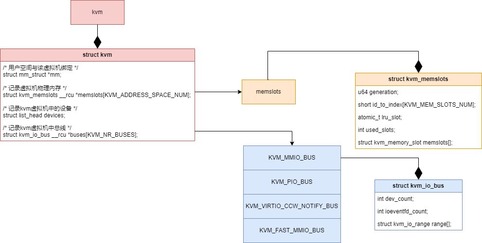
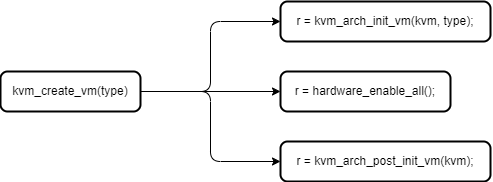
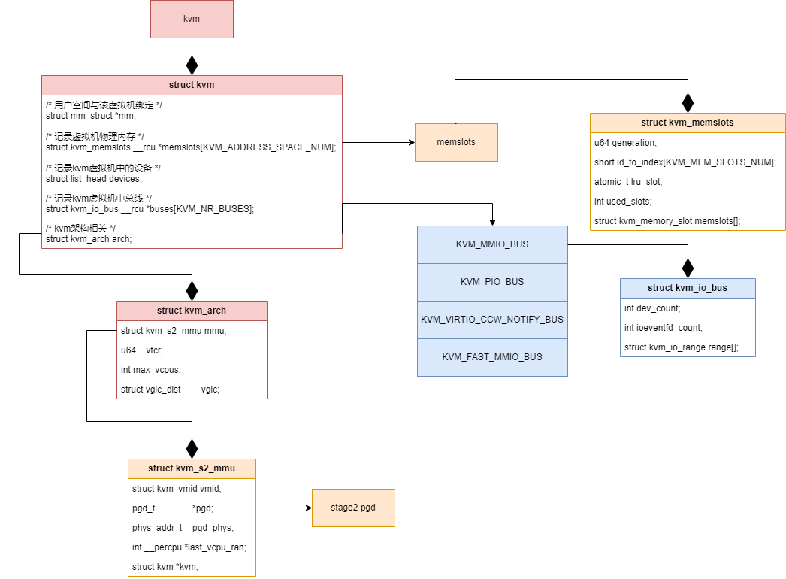

# 5 创建虚拟机

> 内核版本：linux-5.9
>
> 架构：arm64

### 5.1 创建虚拟机概述

通过第4节可以知道kvm提供给用户使用的接口是设备文件`/dev/kvm`，在第4节中已经描述过用户态通过`/dev/kvm`文件的文件描述符的ioctl操作访问内核功能的流程，所以后续将直接通过ioctl命令对应到内核中的具体功能，这中间的过程将省略。用户态程序打开该文件获取文件描述符后，通过ioctl操作可以创建虚拟机，具体的操作如下：

```c
/* 用户态程序 */
int main(int argc, char *argv[])
{
	int sys_fd, vm_fd;

	sys_fd = open(kvm->cfg.dev, O_RDWR);

	......

	vm_fd = ioctl(sys_fd, KVM_CREATE_VM, 0);
	if (vm_fd < 0) {
		pr_err("KVM_CREATE_VM ioctl");
		ret = vm_fd;
		goto err_sys_fd;
	}

err_sys_fd:
	close(sys_fd);
	return ret;
}
```

如上述代码所示，通过`KVM_CREATE_VM`命令，内核会创建kvm虚拟机对象，并将kvm虚拟机对象与一个文件绑定，并返回一个文件描述符给用户态程序。用户态程序后续可使用该描述符去配置和创建虚拟机内部资源。内核在`KVM_CREATE_VM`命令创建kvm虚拟机对象时会进行部分的初始化操作，后文将详细描述`KMV_CREATE_VM`命令在内核中的流程。在分析内核创建虚拟机的过程中，本文将逐渐构建出一个内核中kvm虚拟机初始化后的视图，并通过图例展示。

### 5.2 创建虚拟机内核源码分析

`KVM_CREATE_VM`命令对应于内核中执行`kvm_dev_ioctl_create_vm`函数，所以后面的分析就是针对`kvm_dev_ioctl_create_vm`函数实现的分析，命令对应于函数的具体代码如下所示：

```c
// virt/kvm/kvm_main.c
static long kvm_dev_ioctl(struct file *filp,
			  unsigned int ioctl, unsigned long arg)
{
	long r = -EINVAL;

	switch (ioctl) {
	......
	
	case KVM_CREATE_VM:
		r = kvm_dev_ioctl_create_vm(arg);
		break;
	......
	}

out:
	return r;
}
```

进入`kvm_dev_ioctl_create_vm`函数，该函数会调用图5.1中所示的内容，通过图5.1可以看出来：内核会创建kvm虚拟机对象，并将kvm虚拟机对象与一个文件绑定，并返回一个文件描述符给用户态程序。

<figure><figcaption><p>图5.1 kvm_dev_ioctl_create_vm函数调用图</p></figcaption></figure>

图5.1中与虚拟机相关的最重要的函数就是`kvm_create_vm`函数，该函数会创建一个kvm对象：完成了虚拟机的创建和初始化，其中包含虚拟机内存管理、虚拟机IO总线和一些架构相关的初始化。这里创建的虚拟机只初始化了基础设施，比如初始化管理虚拟机物理内存的数据结构，而其中并没有虚拟机内存数据内容。更多的虚拟机设置则需要在后续通过其他命令进行设置，所以这里就需要将内核中的kvm对象与一个文件进行关联，并将该文件在这个进程中的文件描述符返回给用户态程序。用户态程序就可以根据返回的文件描述符进行后续的设置。

#### 5.2.1 kvm\_create\_vm函数

调用`kvm_create_vm`函数的代码如下所示：

```c
// virt/kvm/kvm_main.c
static int kvm_dev_ioctl_create_vm(unsigned long type)
{
	int r;
	struct kvm *kvm;
	struct file *file;

	kvm = kvm_create_vm(type);
	if (IS_ERR(kvm))
		return PTR_ERR(kvm);

	......
}
```

进入`kvm_create_vm`函数后，该函数首先分配一个`struct kvm`结构体，该结构体就对应于内核中的虚拟机（后文简称kvm、kvm虚拟机）。然后对kvm结构体的部分成员进行初始化，包括与kvm虚拟机关联的进程地址空间、用于记录kvm虚拟机设备的链表以及各种锁，完成这些之后，将kvm的用户引用计数设置为1，代码如下所示：

```c
// virt/kvm/kvm_main.c
static struct kvm *kvm_create_vm(unsigned long type)
{
	struct kvm *kvm = kvm_arch_alloc_vm();
	int r = -ENOMEM;
	int i;

	if (!kvm)
		return ERR_PTR(-ENOMEM);

	spin_lock_init(&kvm->mmu_lock);
	mmgrab(current->mm);
	kvm->mm = current->mm;
	kvm_eventfd_init(kvm);
	mutex_init(&kvm->lock);
	mutex_init(&kvm->irq_lock);
	mutex_init(&kvm->slots_lock);
	INIT_LIST_HEAD(&kvm->devices);

	BUILD_BUG_ON(KVM_MEM_SLOTS_NUM > SHRT_MAX);

	if (init_srcu_struct(&kvm->srcu))
		goto out_err_no_srcu;
	if (init_srcu_struct(&kvm->irq_srcu))
		goto out_err_no_irq_srcu;

	refcount_set(&kvm->users_count, 1);
	
	......
}
```

在内核中锁和引用计数的重要性不言而喻，但不是本文的重点，读者记得这些锁和引用计数在该函数进行了初始化即可。这段代码中本文重点关注三个成员：**mm**、**memslots**和**devices**，其中mm和memslots和虚拟机的内存管理相关，devices和虚拟机的设备管理相关，后续在**虚拟机物理内存管理**和**创建设备**的情景中会用到这些成员。

初始化完上述内容后，将初始化和内存管理相关的**memslots**成员，以及和设备管理相关的**buses**成员，具体代码如下所示：

```c
// virt/kvm/kvm_main.c
static struct kvm *kvm_create_vm(unsigned long type)
{
	......
	
	for (i = 0; i < KVM_ADDRESS_SPACE_NUM; i++) {
		struct kvm_memslots *slots = kvm_alloc_memslots();

		if (!slots)
			goto out_err_no_arch_destroy_vm;
		/* Generations must be different for each address space. */
		slots->generation = i;
		rcu_assign_pointer(kvm->memslots[i], slots);
	}

	for (i = 0; i < KVM_NR_BUSES; i++) {
		rcu_assign_pointer(kvm->buses[i],
			kzalloc(sizeof(struct kvm_io_bus), GFP_KERNEL_ACCOUNT));
		if (!kvm->buses[i])
			goto out_err_no_arch_destroy_vm;
	}
	
	......
}
```

在上述代码中，首先分配了一个`struct kvm_memslots`结构体，并用该结构体初始化了kvm结构体中的memslots成员。在arm64架构下`KVM_ADDRESS_SPACE_NUM`的值为1，所以这里申请了一个`struct kvm_memslots`。然后申请KVM\_NR\_BUSES个struct kvm\_io\_bus结构体，并记录在kvm结构体的buses成员中。

`kvm_alloc_memslots`函数的具体代码如下所示，其中初始化了一些kvm\_memslots结构体中的部分成员，暂时不作分析：

```c
// virt/kvm/kvm_main.c
static struct kvm_memslots *kvm_alloc_memslots(void)
{
	int i;
	struct kvm_memslots *slots;

	slots = kvzalloc(sizeof(struct kvm_memslots), GFP_KERNEL_ACCOUNT);
	if (!slots)
		return NULL;

	for (i = 0; i < KVM_MEM_SLOTS_NUM; i++)
		slots->id_to_index[i] = -1;

	return slots;
}
```

截至目前，我们可以得到以下关于kvm虚拟机的视图，其中详细展示了KVM如何管理虚拟机的物理内存、设备和总线，这些内容将在后续具体场景中加以应用。目前得到的kvm虚拟机视图如图5.2所示。

<figure><figcaption><p>图5.2 kvm虚拟机视图1</p></figcaption></figure>

在`kvm_create_vm`函数中执行完上述内容后，会调用执行如图5.3所示的三个函数。图5.3如下所示。

<figure><figcaption><p>图5.3 kvm_create_vm函数调用图</p></figcaption></figure>

在图5.3中，首先调用`kvm_arch_inint_vm`函数初始化kvm虚拟机中架构相关的内容，该函数每个架构会有不同的实现。然后调用`hardware_enable_all`函数对每个CPU使能其虚拟化功能，在这一步中还可能会初始化VGIC相关的内容（本节暂不分析）。最后调用`kvm_arch_post_init_vm`函数为执行kvm初始化最后的收尾工作提供一个执行点，在arm64架构中该函数是一个空函数，不做任何处理。接下来详细分析前两个函数的实现。

#### 5.2.2 kvm\_arch\_init\_vm函数

```c
// arch/arm64/kvm/arm.c
int kvm_arch_init_vm(struct kvm *kvm, unsigned long type)
{
	int ret;

	ret = kvm_arm_setup_stage2(kvm, type);
	if (ret)
		return ret;
	......
}
```

`kvm_arch_init_vm`函数中首先调用`kvm_arm_setup_stage2`函数设置kvm虚拟机的阶段二地址转换，在arm64架构下就是设置`VTCR_EL2`寄存器的值，`kvm_arm_setup_stage2`函数不进行详细分析了，直接给出当前情景下的运行结果。`kvm_arm_setup_stage2`函数中最终会在kvm结构体中记录kvm虚拟机的`VTCR_EL2`的值，该寄存器控制阶段二地址转换时的规则，例如地址位长、几级页表和vmid等。在后续虚拟机内存内存转换相关的情境中在详细分析该寄存器的内容。

执行完`kvm_arm_setup_stage2`函数之后，调用kvm\_init\_stage2\_mmu函数，代码如下所示：

```c
// arch/arm64/kvm/arm.c
int kvm_arch_init_vm(struct kvm *kvm, unsigned long type)
{
	int ret;

	......

	ret = kvm_init_stage2_mmu(kvm, &kvm->arch.mmu);
	if (ret)
		return ret;

	......
}
```

`kvm_init_stage2_mmu`函数中会为kvm虚拟机的阶段二地址映射申请一个页表，并且会记录该页表的物理地址，kvm\_init\_stage2\_mmu函数具体代码不进行分析，代码到这里就没有复杂的逻辑了。

执行完这些之后，`kvm_arch_init_vm`函数中会将kvm结构体映射到hyp模式下，这样在hyp模式下也能访问到kvm结构体的内容。然后会调用`kvm_vgic_early_init`函数初始化VGIC相关的内容，这里不涉及GIC硬件的部分，只是对kvm结构体内的一些数据成员进行初始化，所以不进行详细的分析。最后记录一下kvm虚拟机中VCPU可能的最大数量，`kvm_arch_init_vm`函数就完成了。代码如下所示：

```c
// arch/arm64/kvm/arm.c
int kvm_arch_init_vm(struct kvm *kvm, unsigned long type)
{
	......

	ret = create_hyp_mappings(kvm, kvm + 1, PAGE_HYP);
	if (ret)
		goto out_free_stage2_pgd;

	kvm_vgic_early_init(kvm);

	/* The maximum number of VCPUs is limited by the host's GIC model */
	kvm->arch.max_vcpus = kvm_arm_default_max_vcpus();

	return ret;
out_free_stage2_pgd:
	kvm_free_stage2_pgd(&kvm->arch.mmu);
	return ret;
}
```

到这里，我们可以得到以下关于kvm虚拟机的视图。相较于之前的视图，新增了架构相关的内容，其中阶段二地址转换所需的页表和设置为这部分的重点，这些内容将在后续具体场景中加以应用。目前得到的kvm虚拟机视图如图5.4所示。

<figure><figcaption><p>图5.4 kvm虚拟机视图2</p></figcaption></figure>

要说明一点，这些都是对kvm结构体的设置，还没有在实际硬件上加载。这里在内核中创建了一个未运行的虚拟机，其中包含内存插槽、总线、vtcr寄存器、阶段二地址转换页表。

> 未完待续\~
