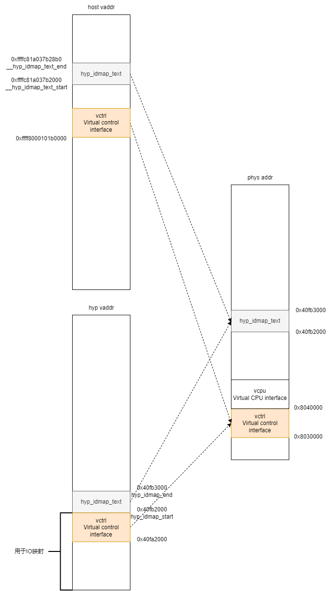

# 6 配置并使能虚拟中断控制器

> 内核版本：linux-5.9
>
> 架构：arm64

### 6.1 情景概述

本章的情景实现：使用qemu-system-aarch64启动带有kvm功能的host linux，然后在host linux中使用kvmtool用户态工具启动一个guest linux。读者若想运行该情景，笔者提供了环境。

> qemu-system-aarch64需自行准备，本文中使用的是8.2.0版本。

拉取下述仓库：

```bash
git clone https://github.com/huloves/kvm-analysis.git
```

拉取完成后运行下述命令即可，具体命令可查看脚本文件中的linux\_vm函数：

```bash
cd kvm-analysis
bash quick_start.sh linux_vm
```

笔者已经准备好了host linux使用的根文件系统，根文件系统中包含：

* 一个编译好的linux-5.9镜像作为客户机镜像（Image）；
* kvmtool用户态工具（lkvm）；
* 供客户机linux使用的根文件系统（rootfs.kvm.cpio）。

启动host linux后，在host linux中运行下述命令，即可运行一个linux虚拟机：

```bash
./lkvm run -k Image -i rootfs.kvm.cpio -p "rdinit=/linuxrc console=ttyAMA0" -m 320 -c 1 --name guest-18
```

在这个情境中，所有的代码均可自行编译。读者若想修改host linux代码，直接修改仓库中的linux-5.9目录中的代码即可。若想修改guest linux的代码，可编译完linux-5.9后，根据提供的根文件系统解压、替换镜像、打包生成新根文件系统。若想修改kvmtool代码，建议从下述仓库中拉取，笔者集成了开源代码中没有的libfdt库，并且在Makefile中添加了--static编译选项。kvmtool代码修改完成后同样记得重新生成根文件系统。kvmtool仓库如下：

```bash
git cloen https://github.com/huloves/kvmtool.git
```

### 6.2 VGICv2概述

本章分析虚拟中断控制器的配置和使能，中断控制器为VGICv2。在KVM实现的虚拟机管理器中，虚拟中断依赖硬件GIC对虚拟化扩展的支持。一个支持虚拟化扩展的GIC示意图如图6.1所示：

<figure><figcaption><p>图6.1 GIC逻辑分区示意图</p></figcaption></figure>

图6.1选自《IHI0048B\_b\_gic\_architecture\_specification》的第2章。关于对图6.1的介绍，建议阅读规范的第2章内容，大概十页的内容，可以对GICv2有个整体的认识。本文在图6.1中需要注意的是Virtual interface control、CPU interface和Distributor。其中Distributor首先接收到中断进行分发。Virtual interface control和CPU interface对于每一个Processor都有一对，负责对中断进行虚拟化，分发给不同的虚拟机，并共同维护虚拟中断的状态。

GIC硬件和虚拟机管理器软件共同实现虚拟中断的示意图如图6.2所示：

<figure><figcaption><p>图6.2 支持虚拟化的ARM处实现的GIC</p></figcaption></figure>

图6.2选自《IHI0048B\_b\_gic\_architecture\_specification》的第5章。图6.2中具体的内容可查看手册的第5章，本文不作详细分析。在图6.2中可以看到，当一个硬件中断发生后，首先到达Distributor。对于可以进行虚拟化的中断，会被传送到Hypervisor（软件），Hypervisor和Virtual interface control中的列表寄存器（List Register）协同完成将中断发送到Virtual CPU interface。Virtual CPU interface收到中断后，在条件允许的情况下就会将中断注入到虚拟机中。这里的条件与普通中断发送到处理器的条件相同，具体可查看手册。

从图6.2中可以看出，要实现虚拟中断需要硬件和软件的配合。一个中断结束时，需要执行两个动作：优先级下降（Priority drop）和中断停用（Interrupt deactivation）。这两个动作需要软硬件协同完成。

通常，在**不开启虚拟化的场景**下，结束一个中断只需要处理器写入中断结束寄存器（GICC\_EOIR）即可，也就是说处理器写入中断结束寄存器后就完了优先级下降和中断停用。但是在**开启了虚拟化的场景**下，会将优先级下降和中断停用的步骤分开：通过写入GICC\_EOIR完成优先级下降，通过写入GICC\_DIR完成中断停用。引用GICv2手册中的内容：这意味着管理程序（Hypervisor）对GICC\_EOIR寄存器的访问会降低CPU接口的运行优先级，但不会停用中断。在写入EOI寄存器后，CPU接口上的运行优先级降低，从而允许后续的中断信号被发送到处理器。这样的配置提高了灵活性。

这个配合中很重要的一个流程是Hyperivor需要先接管中断处理，然后将中断注入给需要的虚拟机。在kvm的场景下，一个物理中断到达后，host linux首先写入GICC\_EOIR寄存器完成优先级下降，然后进行中断注入相关工作，最后写入GICC\_DIR寄存器完成中断停用。

> 这两种配置取决于GICC\_CTLR.EOImodeNS位为0还是1。
>
> 在手册中，对于Hypervior将GICC\_CTLR.EOImodeNS设置为1，GICV\_CTLR.EOImodeNS设置为0的场景，ARM推荐Hypervisor执行优先级下降，虚拟机写入GICV\_EOIR寄存器执行中断停用。但是笔者看代码host linux写入了GICC\_EOIR和GICC\_DIR。在Qemu中经过测试，对于虚拟时钟中断，host linux是否写入GICC\_DIR都可以正常运行虚拟机。

关于GICv2硬件目前先介绍这些内容，其他的硬件相关内容到具体情境中再进行介绍。

### 6.3 VGICv2探测

VGICv2探测工作主要完成系统对GICv2虚拟化扩展访问的初始化、获取一些基本信息以及在kvm模块中注册VGICv2类型设备。VGICv2探测在kvm模块初始化期间进行，整体的流程图如图6.3所示，源码中未画出的函数本文不进行分析：

<figure><figcaption><p>图6.3 VGICv2探测流程图</p></figcaption></figure>

如图6.3所示，在kvm初始化子系统的时候会进行vgic的初始化。在初始化的流程中，首先获取gic中与虚拟化相关的信息，然后根据获取的信息进行探测，最后注册一个维护中断。在探测的函数中实际就是将虚拟CPU接口的物理地址映射到host虚拟地址空间和hyp虚拟地址空间，然后读取寄存器的内容获取支持的列表寄存器个数，最后注册VGICv2类型的kvm设备。注意这里这是注册设备，并没有创建设备，注册设备做了什么在下文马上就会分析。接下来分析图6.3中各个流程的具体步骤。

#### 6.3.1 gic\_get\_kvm\_info函数

gic\_get\_kvm\_info函数的代码如下所示，该函数很简单，就是返回全局变量gic\_kvm\_info：

```c
/* linux-5.9/drivers/irqchip/irq-gic-common.c */
static const struct gic_kvm_info *gic_kvm_info;

const struct gic_kvm_info *gic_get_kvm_info(void)
{
	return gic_kvm_info;
}
```

gic\_kvm\_info的结构体类型如下所示：

```c
/* linux-5.9/include/linux/irqchip/arm-gic-common.h */
struct gic_kvm_info {
	/* GIC type */
	enum gic_type	type;
	/* Virtual CPU interface */
	struct resource vcpu;
	/* Interrupt number */
	unsigned int	maint_irq;
	/* Virtual control interface */
	struct resource vctrl;
	/* vlpi support */
	bool		has_v4;
	/* rvpeid support */
	bool		has_v4_1;
};
```

该结构体全局变量的初始化是在Linux系统初始化GIC设备的时候进行的，具体如何做的本文不再展开了。在我们的场景中GIC设备是根据Qemu构造的设备树进行初始化的，这里将Qemu构造的设备树展示如下：

```dts
intc@8000000 {
	phandle = <0x8002>;
	interrupts = <0x01 0x09 0x04>;
	reg = <0x00 0x8000000 0x00 0x10000
	       0x00 0x8010000 0x00 0x10000
	       0x00 0x8030000 0x00 0x10000
	       0x00 0x8040000 0x00 0x10000>;
	compatible = "arm,cortex-a15-gic";
	ranges;
	#size-cells = <0x02>;
	#address-cells = <0x02>;
	interrupt-controller;
	#interrupt-cells = <0x03>;

	v2m@8020000 {
		phandle = <0x8003>;
		reg = <0x00 0x8020000 0x00 0x1000>;
		msi-controller;
		compatible = "arm,gic-v2m-frame";
	};
};
```

根据设备树可以获得gic\_kvm\_info结构体的成员信息如下，resource成员记录了起始地址和结束地址，下面只给出起始地址，所占用的地址空间大小如设备树所示为0x10000：

| **字段**                   | **值**            |
| ------------------------ | ---------------- |
| `enum gic_type type`     | `GIC_V2`         |
| `struct resource vcpu`   | `0x8040000`      |
| `unsigned int maint_irq` | 根据物理中断号注册得到的virq |
| `struct resource vctrl`  | `0x8030000`      |
| `bool has_v4`            | `false`          |
| `bool has_v4_1`          | `false`          |

到这里gic\_kvm\_info的信息就都获得了，后面进行VGICv2探测和注册维护中断处理程序的流程就是根据该结构体中的内容进行的。

#### 6.3.2 vgic\_v2\_probe函数

该函数首先对gic\_kvm\_info变量中的成员进行一些检查，在我们的场景中这些检查都是可以通过的。通过检查后，执行如下代码，将GIC的虚拟接口控制寄存器（virtual interface control register）映射进host和hyp的虚拟地址空间：

```c
/* linux-5.9/arch/arm64/kvm/vgic/vgic-v2.c */
int vgic_v2_probe(const struct gic_kvm_info *info)
{
	......
		
	ret = create_hyp_io_mappings(info->vctrl.start,
				     resource_size(&info->vctrl),
				     &kvm_vgic_global_state.vctrl_base,
				     &kvm_vgic_global_state.vctrl_hyp);
	if (ret) {
		kvm_err("Cannot map VCTRL into hyp\n");
		goto out;
	}
	
	......
}
```

`create_hyp_io_mappings`函数本文不进行展开了，大致流程就是使用`ioremap`函数将虚拟接口控制寄存器地址空间映射到host的虚拟地址空间中，使用`__create_hyp_private_mapping`函数将虚拟接口控制寄存器地址空间映射到hyp的虚拟地址空间中。映射hyp的地址空间就是在第3章中提到的`hyp_pgd`页目录表中，创建对应的页表项，这里已经提供了物理起始地址和大小。映射完成后，host和hyp模式下的虚拟地址空间示意图如图6.4所示：

<figure><figcaption><p>图6.4 virtual-cpu-control-map示意图</p></figcaption></figure>

如图6.4所示，经过映射后，host和hyp的虚拟地址空间映射了虚拟接口控制寄存器地址空间。图中还展示了之前说的恒等映射。在linux-5.9中，hyp模式的IO虚拟地址空间紧挨着恒等映射代码。图6.4中的数值都是实际运行后的数值。

映射完成后，在host中就可以访问虚拟接口寄存器了，所以在vgic\_v2\_probe函数中接着就获取实际支持的列表寄存器个数：

```c
/* linux-5.9/arch/arm64/kvm/vgic/vgic-v2.c */
int vgic_v2_probe(const struct gic_kvm_info *info)
{
	......

	vtr = readl_relaxed(kvm_vgic_global_state.vctrl_base + GICH_VTR);
	kvm_vgic_global_state.nr_lr = (vtr & 0x3f) + 1;

	......
}
```

获取方式就是读取GICH\_VTR寄存器，该寄存器的布局如图6.5所示：

<figure><figcaption><p>图6.5 GICH_VTR寄存器</p></figcaption></figure>

该图选自《IHI0048B\_b\_gic\_architecture\_specification》第5章。从图6.5可以看到该寄存器的第6位表示实际实现的列表寄存器个数减一，所以要获取实际的列表寄存器个数就是读取该字段的值后加一。

> 注：虚拟接口控制寄存器通常使用GICH\_\*表示，虚拟CPU接口寄存器通常使用GICV\_\*表示。

vgic\_v2\_probe函数的最后，注册VGICv2类型设备，然后初始化kvm\_vgic\_global\_state全局变量的部分成员，具体代码如下所示：

```c
/* linux-5.9/arch/arm64/kvm/vgic/vgic-v2.c */
int vgic_v2_probe(const struct gic_kvm_info *info)
{
	......

	ret = kvm_register_vgic_device(KVM_DEV_TYPE_ARM_VGIC_V2);
	if (ret) {
		kvm_err("Cannot register GICv2 KVM device\n");
		goto out;
	}

	kvm_vgic_global_state.can_emulate_gicv2 = true;
	kvm_vgic_global_state.vcpu_base = info->vcpu.start;
	kvm_vgic_global_state.type = VGIC_V2;
	kvm_vgic_global_state.max_gic_vcpus = VGIC_V2_MAX_CPUS;

	kvm_debug("vgic-v2@%llx\n", info->vctrl.start);

	return 0;
out:
	if (kvm_vgic_global_state.vctrl_base)
		iounmap(kvm_vgic_global_state.vctrl_base);
	if (kvm_vgic_global_state.vcpu_base_va)
		iounmap(kvm_vgic_global_state.vcpu_base_va);

	return ret;
}
```

上述代码中的kvm\_register\_vgic\_device函数就不开展了，代码比较简单，大致就是注册VGICv2设备的操作函数。VGICv2的操作函数如下所示：

```c
/* linux-5.9/arch/arm64/kvm/vgic/vgic-kvm-device.c */
struct kvm_device_ops kvm_arm_vgic_v2_ops = {
	.name = "kvm-arm-vgic-v2",
	.create = vgic_create,
	.destroy = vgic_destroy,
	.set_attr = vgic_v2_set_attr,
	.get_attr = vgic_v2_get_attr,
	.has_attr = vgic_v2_has_attr,
};
```

所谓注册，就是内核的kvm模块有一个kvm\_device\_ops\_table全局指针数组。该数组中保存了kvm模块中支持的设备操作集合，通过索引与特定的kvm设备类型相关联。代码如下所示：

```c
/* linux-5.9/virt/kvm/kvm_main.c */
static const struct kvm_device_ops *kvm_device_ops_table[KVM_DEV_TYPE_MAX] = {
#ifdef CONFIG_KVM_MPIC
	[KVM_DEV_TYPE_FSL_MPIC_20]	= &kvm_mpic_ops,
	[KVM_DEV_TYPE_FSL_MPIC_42]	= &kvm_mpic_ops,
#endif
};
```

综上所述，注册VGICv2类型设备就是在`kvm_device_ops_table`的`KVM_DEV_TYPE_ARM_VGIC_V2`索引处保存`kvm_arm_vgic_v2_ops`操作集。

#### 6.3.3 注册维护中断处理函数

最后就是为虚拟CPU接口注册一个维护中断，GICv2手册中关于维护中断的作用写了很多，但是在linux-5.9中为该中断注册的处理函数非常简单，代码如下所示：

```c
/* linux-5.9/arch/arm64/kvm/vgic/vgic-init.c */
static irqreturn_t vgic_maintenance_handler(int irq, void *data)
{
	/*
	 * We cannot rely on the vgic maintenance interrupt to be
	 * delivered synchronously. This means we can only use it to
	 * exit the VM, and we perform the handling of EOIed
	 * interrupts on the exit path (see vgic_fold_lr_state).
	 */
	return IRQ_HANDLED;
}
```

通过注释可以看到，触发该中断后在中断处理程序中只会执行手册中说的优先级下降和中断停用，而手册中其他的复杂功能，linux-5.9是通过其他函数实现的。

到这里VGICv2的探测就结束了。在这个过程中维护了`kvm_vgic_global_state`全局变量，经过初始化后该变量的内容如下所示：

| **字段**                                | **值**              |
| ------------------------------------- | ------------------ |
| `enum vgic_type type`                 | `GIC_V2`           |
| `phys_addr_t vcpu_base`               | `0x8040000`        |
| `void *vcpu_base_va`                  | （未初始化，默认空指针）       |
| `void *vcpu_hyp_va`                   | （未初始化，默认空指针）       |
| `void *vctrl_base`                    | `0xff8000101b0000` |
| `void *vctrl_hyp`                     | `0x40fa2000`       |
| `int nr_lr`                           | `4`                |
| `unsigned int maint_irq`              | `1`                |
| `int max_gic_vcpus`                   | `8`                |
| `bool can_emulate_gicv2`              | `true`             |
| `bool has_gicv4`                      | （未初始化，默认`false`）   |
| `bool has_gicv4_1`                    | （未初始化，默认`false`）   |
| `struct static_key_false gicv3_cpuif` | （未初始化）             |
| `u32 ich_vtr_el2`                     | （未初始化）             |

**说明**：

* 该表格展示了一个名为 `kvm_vgic_global_state` 的结构体，包含 `struct vgic_global` 的详细信息。
* `struct vgic_global` 保存了与 KVM 虚拟化环境中 GIC（Generic Interrupt Controller）相关的全局状态信息。
* 字段值包括 GIC 类型、虚拟CPU和控制器的物理/虚拟地址、IRQ 数量、最大虚拟CPU数等。
* 某些字段此时（如指针或未明确的值）为空。

### 6.4 创建VGICv2设备

> 未完待续\~
