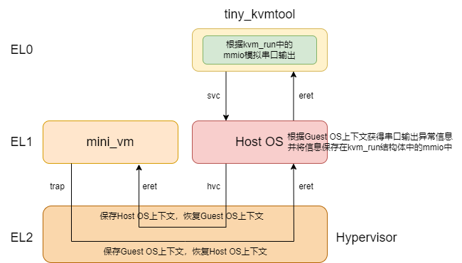

# 6 配置并运行最小虚拟机

> 内核版本：linux-5.9
>
> 架构：arm64

本章将会配置并运行一个最小虚拟机，源码已经准备好了。根据配置并运行最小虚拟机这一场景，进行分析。这个最小虚拟机是本文自定义的，所以本章首先介绍一下什么是最小虚拟机。介绍完最小虚拟机之后，介绍运行该最小虚拟机的步骤。最后对配置和运行最小虚拟机进行分析，分析的最后将会给出一个配置该最小虚拟机后，内核中kvm虚拟机的抽象视图。

## 6.1 最小虚拟机

> 最小虚拟机参考该文章：[https://zhuanlan.zhihu.com/p/676339639](https://zhuanlan.zhihu.com/p/676339639)

在x86架构的电脑上，用qemu-system-aarch64运行启用kvm功能的linux-5.9作为Host OS。然后在Host OS中通过kvm创建一个最小虚拟机，在最小虚拟机中执行一段简单的hello world汇编程序。其中输出功能通过模拟串口实现。最小虚拟机的框架图如图6.1所示：

<figure><figcaption>
图6.1 最小虚拟机框架图
</figcaption></figure>

图6.1其实和第一章的图1.5是基本一样的，其中把Guest OS具体到本章的最小虚拟机，qemu换为本章编写的一个tiny\_kvmtool应用程序。第一章中没有分析type2型串口模拟的具体流程，本章将会进行分析。

## 最小虚拟机操作指南

> 未完待续\~
