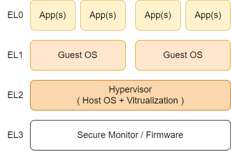
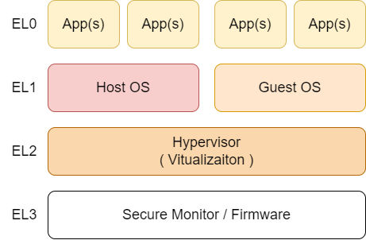
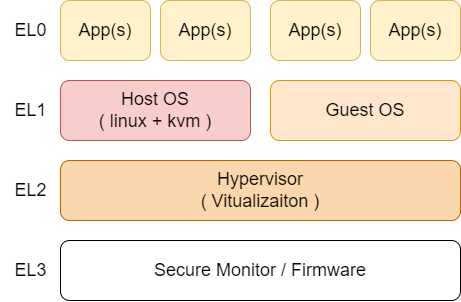
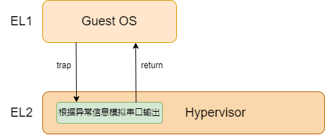
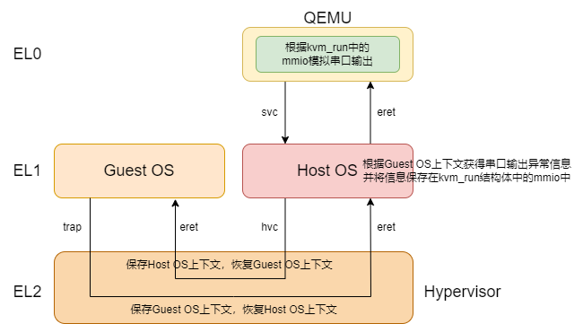

# 1 type1型和type2虚拟机管理器

> 内核版本：linux-v5.9
>
> 架构：arm64

在arm64架构中，共有EL3到EL0四个异常级别，EL3异常级别最高。通常操作系统（如linux）运行在EL1，应用程序运行在EL0，EL2则运行hypervisor管理程序。虚拟机管理器有type1型和type2型之分，kvm属于type2型虚拟机管理器。

首先思考type1型和type2虚拟机管理器有什么相同之处，即同样作为虚拟机管理器，它们都完成哪些工作。

1. **虚拟机资源的管理**：虚拟机地址空间的管理由虚拟机管理器统一管理；
2. **虚拟机的调度和切换**：虚拟机运行时VCPU需要进行调度和上下文切换；
3. **虚拟设备的管理**：虚拟机使用的虚拟设备即设备的中断由虚拟机管理器统一管理。

知道了两类虚拟机管理器都需要完成的工作后，再说明他们在完成上述工作时有何不同。type1型的虚拟机管理器在完成上述工作时，所有的行为都是在EL2完成的。而type2型的虚拟机管理器在完成上述工作时，大部分是在EL1完成的，即在EL1将虚拟机的运行时上下文准备好，而在EL2级别只实现**模式切换**，即将准备好的运行时上下文加载进寄存器。这里提到了**模式切换**，暂不描述。

然后再思考为什么会出现type1型和type2型在处理这些工作时存在不同的情况。解决这个问题后，再思考两种类型的优劣，也许就是type1型和type2型虚拟机出现的初衷。type1型虚拟机管理器完成虚拟机管理器的工作都在EL2，因为自虚拟机管理器启动到运行时，以及对资源的管理都是在EL2异常级别。type1型的架构图如图1.1所示。

<figure><figcaption>
​图1.1 type1型虚拟机管理器的架构图​
</figcaption></figure>

如图1.1所示，EL2运行的是虚拟机管理器（Hypervisor），EL1运行的是客户机（Guest OS），层次分明。图1.1中的Hypervisor一定程度上是一个运行在EL2异常级别的操作系统和虚拟化功能的组合（Host OS + Vitrulization）。在这样的组织架构下，EL2有能力进行资源管理，因为它本身具有操作系统的功能，所以虚拟机管理器需要完成的工作都在EL2完成。而type1型虚拟机管理器的架构图如图1.2所示。

<figure><figcaption>
​图1.2 type2型虚拟机管理器的架构图
</figcaption></figure>

如图1.2所示，EL2异常级别仅提供虚拟化功能，而对资源进行管理的Host OS在EL1运行。在这样的组织架构下，自然在需要完成虚拟机管理器的工作时，需要到EL1的Host OS运行，在准备好Guest OS的运行时上下文后，切换至Guest OS运行。这里的Host OS具体就可以是开启了kvm功能的linux，如图1.3所示。

<figure><figcaption>
图1.3 linux+kvm的虚拟化框架图
</figcaption></figure>

如图1.3所示，开启了kvm功能的linux充当的就是Host OS的角色，全权负责对系统资源，包括Guest OS的管理。type1型和type2型虚拟机管理器由于组织架构的不同，导致实现虚拟机管理器所需的工作时出现不同之处。那么这两种类型的虚拟机管理器各有什么优劣。粗略的说是type1型效率更高，type2型效率低。而type2型可以复用已有的资源管理框架，如linux的内存管理、进程管理和设备驱动，type1型则需要自己实现或进行代理。type1型可以说是天生是为了管理虚拟机，type2型则可以说是为系统提供了虚拟化扩展和硬件加速。软件系统生态也会影响两类虚拟机管理器，linux有成熟的生态，例如开源的QEMU模拟器，设备驱动。所以两类虚拟机管理器孰优孰劣，则要根据使用场景进行判断。

通过一个情景来具体说明为何type1型效率高，而type2型效率低。假设虚拟机管理器通过地址映射为Guest OS配置了虚拟串口，然后Guest OS访问该串口以向串口设备传输一个字符。type1型的访问流程大致如图1.4所示。

<figure><figcaption>
图1.4 type1型模拟串口输出大致流程图
</figcaption></figure>

如图1.4所示，Guest OS在访问虚拟串口的时候会触发一个EL1同步异常，并在EL2被捕获。EL2获得该异常后，根据异常信息模拟串口输出，模拟完成后返回即可，其中异常信息通常包含触发异常的地址、读写操作标识、读写的内容和长度等。而type2型的访问大致流程如图1.5所示。

<figure><figcaption>
​图1.5 type2型模拟串口输出大致流程图
</figcaption></figure>

图1.5中的详细内容暂不描述，此处仅用于type1型和type2型的对比。如图1.5所示，Guest OS同样是访问虚拟串口。则需要更复杂的流程，经过多次异常级别的转换。这个对比中同样也说明了type2型的优势，即能够复用Host OS（linux）的机制，并且复用Host OS的软件生态，使得Host OS和Host OS的软件生态也获得了虚拟化扩展和硬件加速能力。对type1型和type2型的讨论到此为止，kvm场景为type2型虚拟机管理器，后文将着重描述type2型，并具体到kvm。
